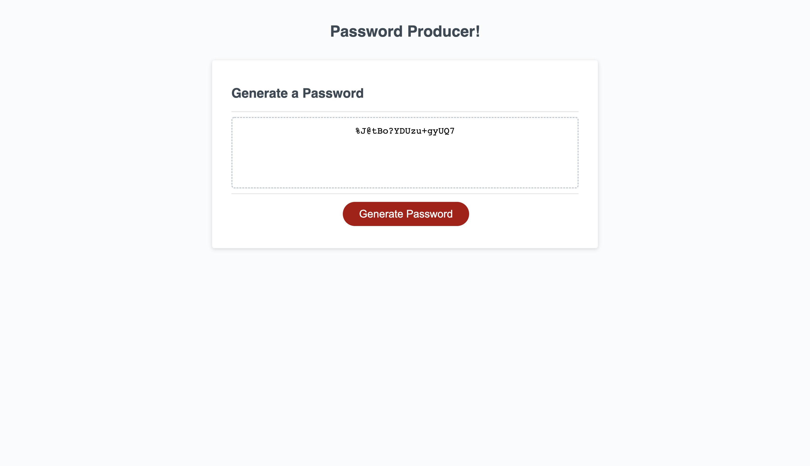

# password-producer

## Description

Trying to come up with unique, secure passwords for each of your logins can be tedious. Introducing Password Producer! Allowing you to specify how long your password should be and which character types it should include, Password Producer generates an unlimited supply of randomly generated passwords with the click of a button!

## Installation

No installation is required for this application.

## Usage

Access the application [here](https://kierstenv.github.io/password-producer/).
1. Choose a password length. (*must be 8–128 characters*)
2. Choose which character types to include in the password:
    - lowercase, uppercase, numeric, and/or special characters (***must choose at least one***)
3. Generate password!

To generate another password with the same criteria, simply click the "Generate Password" button again.

## Languages and Tools

## Credits

*References*:
- [UT Austin Full Stack Web Development Boot Camp](https://techbootcamps.utexas.edu/coding/?utm_source=coursereport&utm_medium=ApplyNow)

- [MDN Web Docs](https://developer.mozilla.org/en-US/)

## License

Distributed under the MIT License. See [LICENSE.txt](./LICENSE.txt) for more information.
